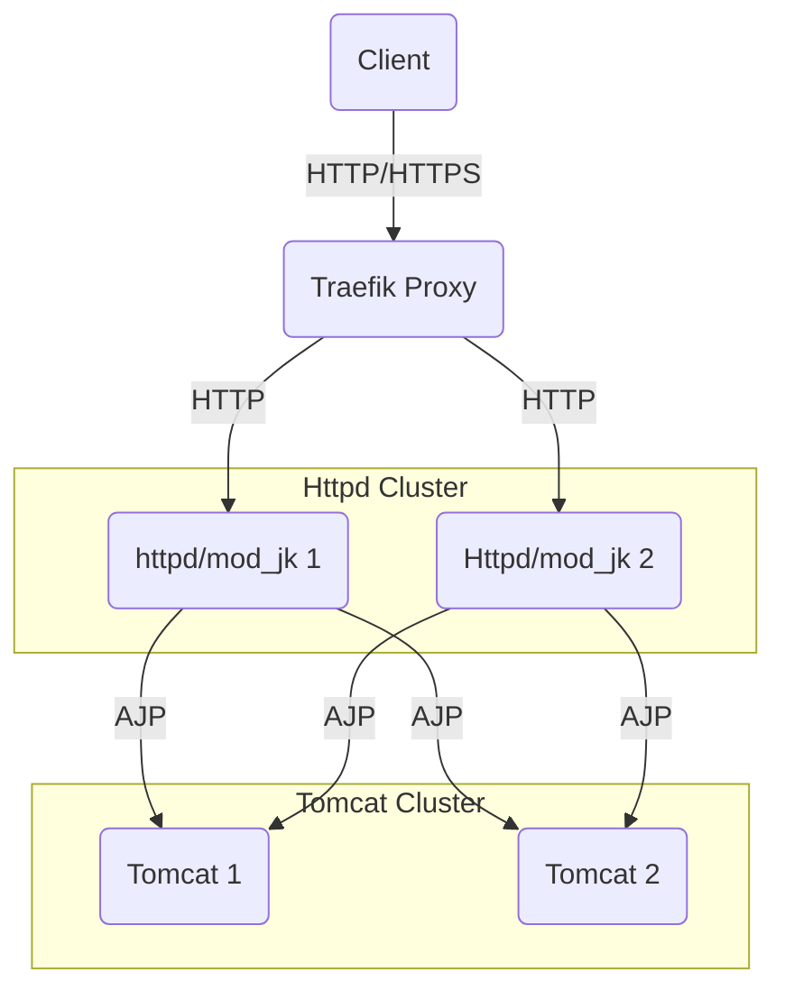

# httpd-ajp-tomcat

- apache(mod_jk) => tomcat => hello servlet

## dependencies

- docker
- docker-compose >= 2.x
- mvn
- java 17

## start

We mount image directly!

```shell
mvn package
docker compose --profile observability build
docker-compose up -d
docker-compose --profile observability up -d
curl $(docker compose port 80)/hello
# access observability
docker compose exec httpd curl -s "127.0.0.1:9114/jk-watch?mime=xml"
docker compose exec httpd curl -s "127.0.0.1:9118/server-status?auto"
docker compose exec httpd curl -s "tomcat:8004/metrics"
```

## tear down

```shell
docker compose down -v
docker compose down -v --rmi all --remove-orphans
mvn clean package
```

clean caches
```
docker system prune
docker builder prune
```

## kubernetes



- Use of Traefik or separate loadbalancer
- Session replications
- Blue Green Deployment with separate deployments
  - Status disable of all worker v1
  - status enable to worker v2
  - Wait to kill Blue after all user sessions are gone!
- Migration with Valve and rename of session id....
- Open jkstatsus amd jk-manage
  - https://tomcat.apache.org/connectors-doc/reference/status.html
- export metrics
  - https://github.com/nlighten/tomcat_exporter
  - jolokia
  - jmx-exporter
- Build war a mount as image volume as kubernetes

## modjk_exporter

- modjk_exporter runs inside the same network namespace as apache.
- So http://127.0.0.1 inside modjk_exporter reaches Apache running in the same container namespace.
- You can’t publish ports from modjk_exporter in this mode. If you need to expose metrics, expose them from apache or use a shared network.
- review docker-compose

```shell
docker compose exec httpd curl "127.0.0.1/jk-watch?mime=xml"
# or
docker exec -it httpd2tomcat-httpd-1 curl "127.0.0.1/jk-watch?mime=xml"
<?xml version="1.0" encoding="UTF-8" ?>
<jk:status
  xmlns:jk="http://tomcat.apache.org">
<jk:server
  name="127.0.0.1"
  port="80"
/>
<jk:time
  datetime="20250430132307"
  tz="+0000"
  unix="1746019387"
/>
<jk:software
  web_server="Apache/2.4.62 (Debian) mod_jk/1.2.48"
  jk_version="mod_jk/1.2.48"
/>
<jk:ajp_workers
  count="1"
>
  <jk:ajp
    name="tomcat"
    type="ajp13"
    host="tomcat"
    port="8009"
    address="172.27.0.3:8009"
    source="undefined"
    connection_pool_timeout="0"
    ping_timeout="10000"
    connect_timeout="0"
    prepost_timeout="0"
    reply_timeout="0"
    connection_ping_interval="0"
    retries="2"
    recovery_options="0"
    busy_limit="0"
    max_packet_size="8192"
    used="0"
    errors="0"
    client_errors="0"
    reply_timeouts="0"
    transferred="0"
    read="0"
    busy="0"
    max_busy="0"
    connected="0"
    max_connected="0"
    map_count="2"
    last_reset_at="1746019352"
    last_reset_ago="35"
  />
      <jk:map
        id="1"
        server="172.27.0.2"
        uri="/*"
        type="Wildchar"
        source="JkMount"
        reply_timeout="-1"
        sticky_ignore="0"
        stateless="0"
        fail_on_status=""
        active=""
        disabled=""
        stopped=""
        use_server_errors="0"
      />
      <jk:map
        id="2"
        server="172.27.0.2 [*:80]"
        uri="/*"
        type="Wildchar"
        source="JkMount"
        reply_timeout="-1"
        sticky_ignore="0"
        stateless="0"
        fail_on_status=""
        active=""
        disabled=""
        stopped=""
        use_server_errors="0"
      />
</jk:ajp_workers>
  <jk:result
    type="OK"
    message="Action finished"
  />
</jk:status>
```

## otel

- [OpenTelemetry Protocol Exporter](https://opentelemetry.io/docs/specs/otel/protocol/exporter/)

## references
- [apache_exporter](https://github.com/Lusitaniae/apache_exporter)
- [JMX exporter](https://github.com/prometheus/jmx_exporter)
- [Otel trouble](https://opentelemetry.io/docs/collector/troubleshooting/)