# Simplifying Apache Tomcat Session Clustering with Kubernetes

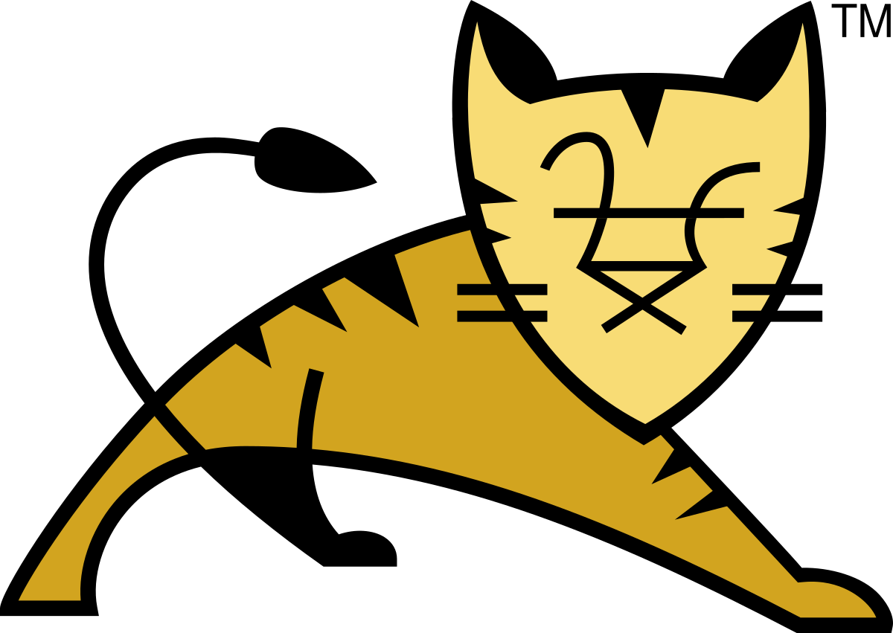 <br/>**play with** 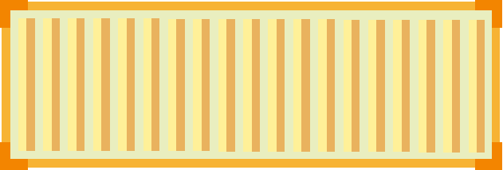


---

## Efficient Clustering with Apache Tomcat at Kubernetes

Keeping state synchronized across multiple **Apache Tomcat** nodes is a well-established practice — and now it’s achievable using native Kubernetes capabilities. This session demonstrates how traditional session clustering can evolve from manual configuration into a Kubernetes-native solution. You’ll learn how to leverage Tomcat’s Cluster built-in mechanisms to enhance scalability and fault tolerance.

**[Peter Rossbach](mailto://peter.rossbach@bee42.com)** is the founder of [bee42 solutions gmbh](https://bee42.com), a system architect, DevOps advocate, Apache member, Apache Tomcat committer, infracoder, and IT mentor. His expertise helps companies gain new insights, and he trains the next generation of Cloud Native Engineers.

---

## Topics

- 30 Year of Java Web with Servlets
- Apache Tomcat Architecture
- HTTP 1/1, HTTP2, HTTP3
- Tomcat Scale with Containers
- Tomcat Observability
- Tomcat Replication Cluster
- The Kubernetes Perspective


---

## Demos

- Normal Tomcat with Traefik
- Tomcat Cluster Replication - clustertest
- Autoscale with Kubernetes

---

## Apache Tomcat History: Part 1

<div class="mermaid">
%%{init: { 'logLevel': 'debug', 'theme': 'forest' } }%%
timeline
    title From Collaboration to Creation: Building the Right Web Engine Together

    1995 : Jetty WebServer Contest : Servlet API 1.x
    1996 : Jeeves : Jserv : Early Servlet Container by James Duncan Davidson 
    1998 : Servlet 2.1 /2.2 : Jo! Servlet Engine : Early Servlet Books
    1999 : Tomcat 3 : Tomcat Goes Open Source under the Apache Jakarta Umbrella
    2000 : Tomcat 3.3 : Catalina Architecture by Craig McClanahan 
    2001 : Tomcat 4 : Servlet 2.3 : Tomcat Modularity Growth 
    2005 : Tomcat 5 : Servlet 2.4 : Apache Tomcat becomes an Apache Top-Level Project
 </div>

---

## Apache Tomcat History: Part 2

<div class="mermaid">
%%{init: { 'logLevel': 'debug', 'theme': 'forest' } }%%
timeline
    title Evolving Java Web: A Community’s Journey to the Right Solution

    2006 : Tomcat 6 : Servlet 2.5
    2011 : Tomcat 7 : Servlet 3.0 : WebFragments
    2014 : Tomcat 8 : Servlet 3.1 : Spring Boot Adopts Embedded Tomcat
    2018 : Tomcat 9 : Servlet 4 : Jakarta EE moves to Eclipse Foundation
    2020 : Jakarta Servlet API Renaming
    2022 : Tomcat 10 : Servlet 5 : Jakarta EE 10
    2024 : Tomcat 11 : Servlet 6.1 : Jakarta EE 11 : Modernization & Features : Virtual Thread Support
</div>

---

## Notable Apache Tomcat Contributors

- __James Duncan Davidson__ (Creator of Tomcat)
- __Craig McClanahan__ (Creator of the Catalina Architecture)
- __Remy Maucherat__ (Core Developer and Long-time Maintainer)
- __Mark Thomas__ (Current Release Manager and PMC Chair)
- __Rainer Jung__ (HTTPD and Tomcat Performance Expert, mod_jk)
- __Filip Hanik__ (Tomcat Comet and Clustering Developer)
- __Jean-Frederic Clere__ (Tomcat & Web Server Integration Specialist)
- __Peter Rossbach__ (Tomcat Advocate, Clustering Developer, JMX,  mod_jk)

__Most exciting of all__: the incredible __Apache community__ — a vibrant ecosystem of users, maintainers, and dedicated committers.

---

## Challenge: Scale sticky workload with Tomcat

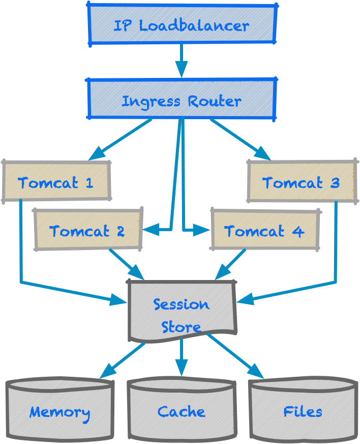

- Use an external load balancer
- Configure HTTP-Proxy to route traffic between multiple Tomcat instances
- Use a sticky session to route traffic to the same Tomcat instance
- Use a session replication to synchronize the session state between Tomcat instances

---

### Apache Tomcat Architecture

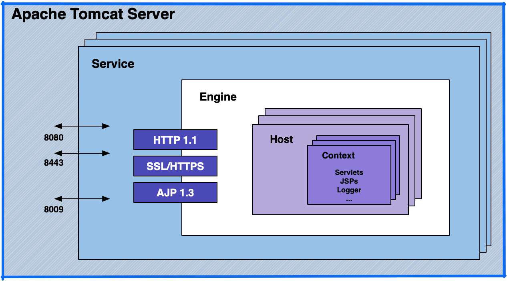

---

### Apache Tomcat Request/Response Pipeline

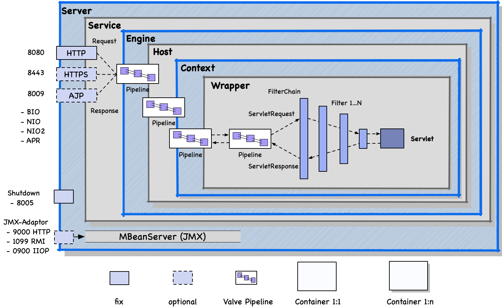

---

### Overview of Java Servlet API

<div class="mermaid" width="50%" height="50%">
classDiagram
    class Servlet {
        +init()
        +service()
        +destroy()
        +getServletConfig()
        +getServletInfo()
    }

    class GenericServlet {
        +log()
        +init()
        +service()
    }

    class HttpServlet {
        +doGet()
        +doPost()
        +doPut()
        +doDelete()
        +doHead()
        +doOptions()
        +doTrace()
    }

    class ServletRequest {
        +getParameter()
        +getInputStream()
        +getAttribute()
        +getReader()
        +getRemoteAddr()
    }

    class ServletResponse {
        +getWriter()
        +setContentType()
        +setCharacterEncoding()
    }

    class HttpServletRequest {
        +getSession()
        +getCookies()
        +getHeader()
        +getMethod()
        +getRequestURI()
        +getHttpServletMapping()
    }

    class HttpServletResponse {
        +setStatus()
        +addCookie()
        +sendError()
        +sendRedirect()
    }

    class ServletContext {
        +getAttribute()
        +getInitParameter()
        +getResource()
    }

    class Filter {
        +doFilter()
        +init()
        +destroy()
    }

    class FilterChain {
        +doFilter()
    }

    class AsyncContext {
        +start()
        +dispatch()
        +complete()
    }

    class ServletConfig {
        +getServletName()
        +getInitParameter()
        +getServletContext()
    }

    Servlet <|-- GenericServlet
    GenericServlet <|-- HttpServlet

    ServletRequest <|-- HttpServletRequest
    ServletResponse <|-- HttpServletResponse

    Servlet --> ServletConfig
    Servlet --> ServletContext
    Filter --> FilterChain
    HttpServletRequest --> AsyncContext
</div>


---

### Java Web Servlet Container Module - WAR

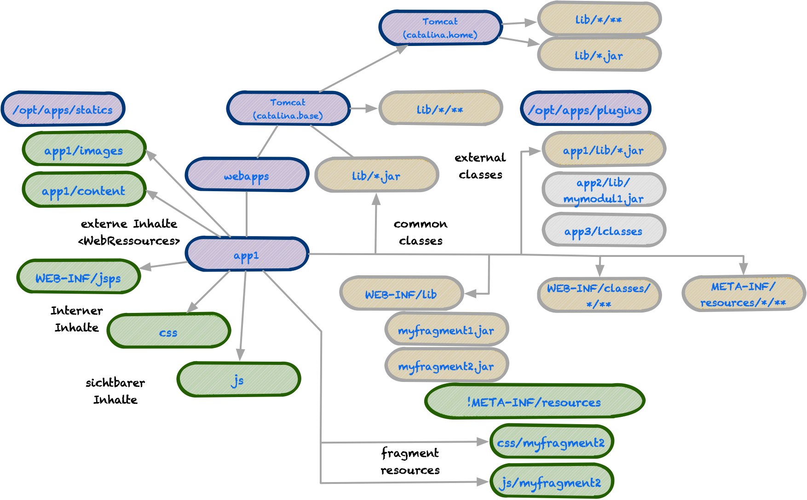

---

#### Feature of Tomcat web modules

- Virtual Hosts
- Multiple Apps
- Web Fragements
- WAR Overlay
- WebApp Versioning
- File Caching
- JSP Transformation
- Dynamic Reloading and Replacement
- Flexible Classloader Setup
- Customize Integration Support (context.xml)

---

## Route Tomcat with Traefik

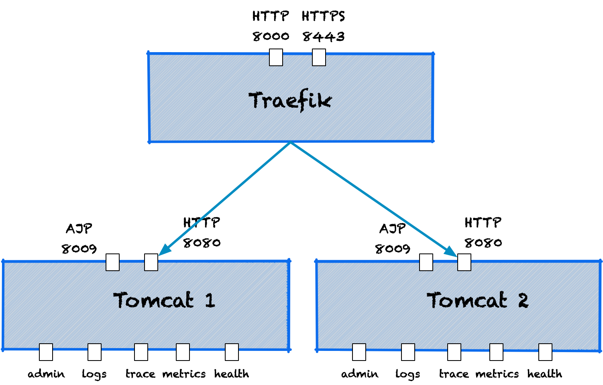

---

## DEMO I: Scale a Tomcat containers with docker

- Setup your own `server.xml`
- Config the JVM and Tomcat with `setenv.sh`
- Define a `logging.properties` to support stdout logging.
- Remove Default Webapps
- Controlle Sticky Session (jvmRoute)
- Use HTTP Ingress Controller (Traefik) 

---

### DEMO I: Apache Tomcat Container Analysis

- Add exporters for JMX Access via RMI and Jolokia
- Access Logs Written only to Files
- Catalina Logs output to stdout
- Remove unused or demo webapps from the image for production builds.
- APR Initialization but NIO Connector Used
- Use minimalist production container image
- Check Java >=22 with **Foreign Function & Memory API (FFM) Support**
- Explore Cgroup resource restrictions
  - Dynamic Kubernetes Resize Policy
- Setting session cookie is complex and requires careful attention of details
- Separate the webapp from the tomcat container

---

## Tomcat Oberservability

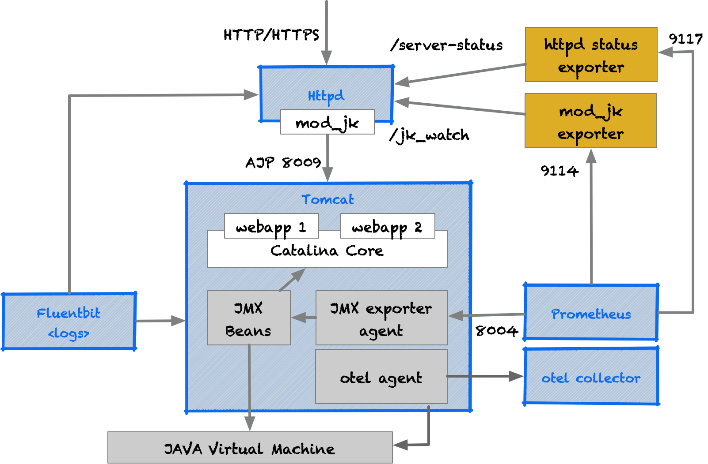

---

## Observability Topics

- Log Management (fluentbit, logstash, ...)
- Tracing (Jaeger, Tempo, ...)
- Metrics (Prometheus, Thanos, ... )
- Health
- Alerting (Grafana Alerts, Service Now)
- Visualisation(Kibana, Grafana)
- Instrumentation (Opentelemetry)

---

## Observability Java Integrations

- JMX Bean Infrastructure Monitoring
- Use a Java Agent to collect metrics
- Sidecar container or webapp for metrics
- Manually or Automaticaly Application Instrumentation

---

## Demo II: Observability Enhancements

- Integrate httpd with mod_jk for advanced routing and load balancing
- Build custom Apache Tomcat container images tailored for monitoring
- Export runtime metrics with Prometheus-compatible exporters
- Implement a mod_jk status endpoint for real-time monitoring
- Attach Java Agent exporters for in-depth application metrics
- Identify and expose key monitoring data across the system

---

## Demo II: Leasons Learned - Need an `AI` Agent...

- Implementing observability is a complex and resource-intensive challenge.
- The effort often exceeds initial expectations, especially in production-grade environments.
- A major challenge lies in the analysis and interpretation of large volumes of data from various sources.
- Standardizing log formats into structured events is essential for efficient processing.
- Distributed tracing holds great potential but demands new skillsets in data analysis and correlation.
- Increasing the use of auto-instrumentation with OpenTelemetry standards can significantly improve observability maturity.

---

## Apache Tomcat meets Kubernetes


---

### Moving Beyond Containers

Evolving from basic containerization to scalable architectures

- **Scaling Out**: Horizontal scaling strategies for stateless and stateful workloads
- **Container Orchestration**: Leveraging platforms like Kubernetes for automation and resilience
- **Application Deployment**: Streamlining CI/CD pipelines for faster releases
- **Lift and Shift**: Migrating existing applications into container-based environments
- **High Availability**: Designing for fault tolerance and service continuity
- **Application Lifecycle Management**: From initial deployment to day-2 operations

---

### Httpd Pods

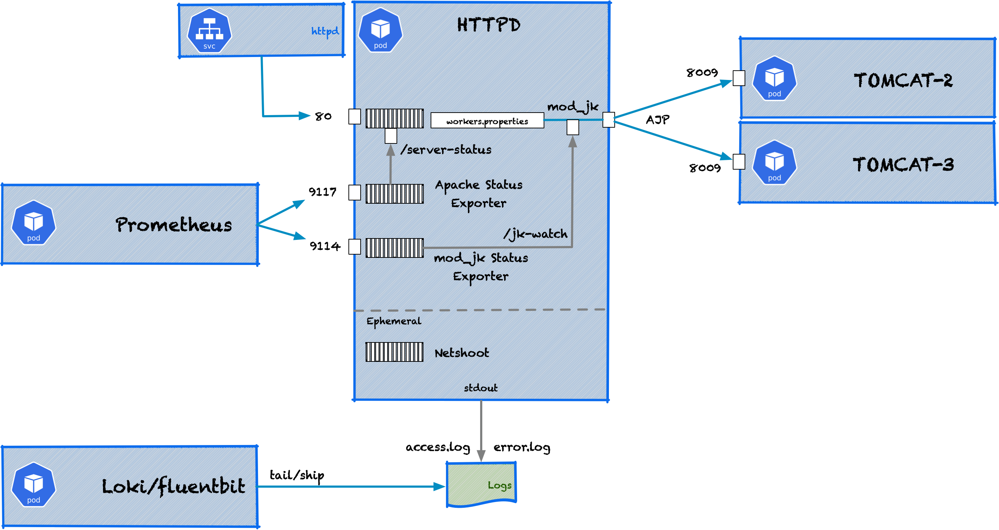

---

### Tomcat Cluster Pods

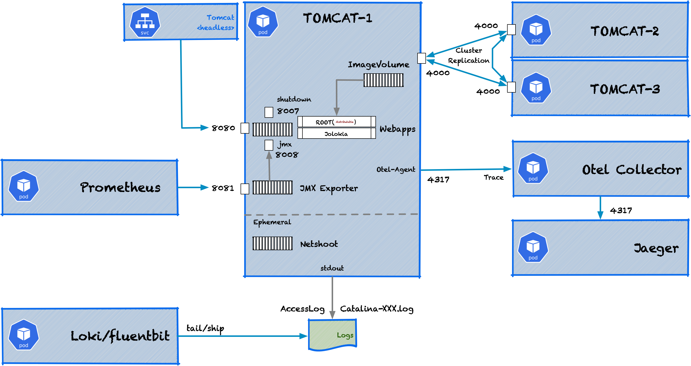

---

## Demo III: Setup


---

## Demo III: Scale-Out Challenges

- Organize distributed session cache groups effectively
- Ensure sticky session routing across replicas
- Achieve zero-downtime deployments and scaling
- Integrate observability from the beginning
- Modularize deployment pipelines and container images

---

### Tomcat Cluster Components

In Memory Session Replication with tribes

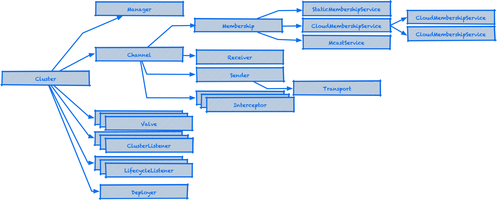

---

### Tomcat Cluster Configuration

```xml
<Cluster className="org.apache.catalina.ha.tcp.SimpleTcpCluster" channelSendOptions="8">
    <Manager className="org.apache.catalina.ha.session.DeltaManager"
             expireSessionsOnShutdown="false"
             notifyListenersOnReplication="true"/>
    <Channel className="org.apache.catalina.tribes.group.GroupChannel">
      <Membership 
        className="org.apache.catalina.tribes.membership.cloud.CloudMembershipService"
        membershipProviderClassName="kubernetes" />
    </Channel>
    <Valve className="org.apache.catalina.ha.tcp.ReplicationValve" filter=""/>
    <Valve className="org.apache.catalina.ha.session.JvmRouteBinderValve" />
    <ClusterListener className="org.apache.catalina.ha.session.ClusterSessionListener"/>
</Cluster>
```

---

### Kubernetes Membership - DNS

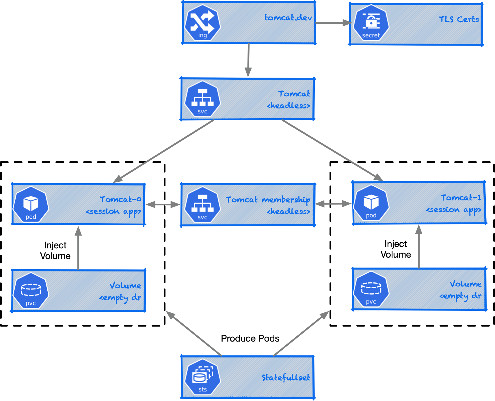

---

### Kubernetes Membership - API Server

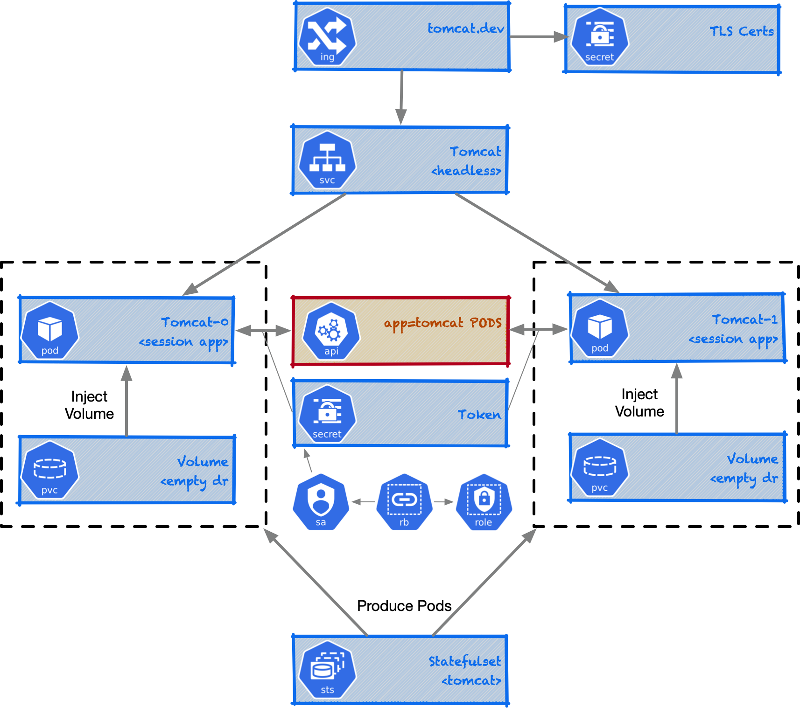

---
### Next Level - Kubernetes Tomcat Operator 

<div class="mermaid">
graph LR
  A[Kubernetes Cluster]

  subgraph Operator
    B[Tomcat Operator]
    B1[CRD: TomcatCluster]
  end

  A --> B
  B --> B1
  B1 --> C[StatefulSet: tomcat-<replicas>]
  B1 --> D[Service: headless + clusterIP]
  B1 --> E[ConfigMap/Secret: app config, credentials]
  B1 --> F[PVC: per replica]

  C --> G[Pod: tomcat-0]
  C --> H[Pod: tomcat-1]

  G --> F
  H --> F

  D --> I[Ingress or LoadBalancer]
  I --> User[User / Browser]

  style A fill:#f9f,stroke:#333,stroke-width:2px
  style B fill:#bbf,stroke:#333
  style B1 fill:#ddf,stroke:#333
  style C fill:#afa
  style D fill:#cff
  style F fill:#ffd
</div>

---

### Demo III: Next Topics to Solve

- Design and implement a **Farm Deployer** for managing Tomcat clusters at scale
- Enable **Zero-Downtime** Upgrades with safe state migration strategies
- Define **Cluster Topologies** optimized for resilience and rolling deployments
- Build mechanisms to detect **health states** and trigger self-healing actions
- **Measure performance** and identify cost drivers for better resource efficiency
- Integrate **security hardening**, including TLS, network policies, and access controls
- **Increase automation** and introduce self-regulating capabilities in deployments

---

### Topology Multiple App Versions

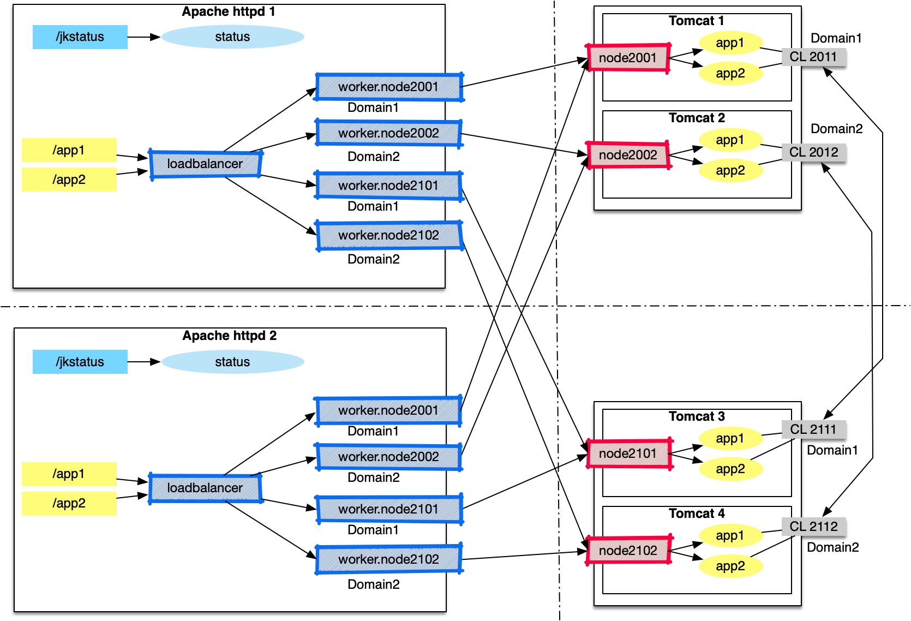

---

### Topology Racks

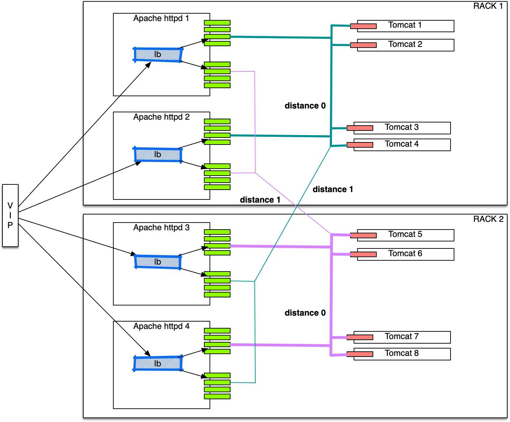

---

### Demo III: Lessons Learned

- The Tomcat cluster setup works as designed.
- Achieving zero downtime is challenging and requires careful orchestration.
- Network security needs attention — enable TLS encryption.
- Evaluate whether Java serialization is sufficient for your use case.
- Deployment strategies must be streamlined for scalability.
- Topology-aware routing can improve performance and resilience.
- Health checks need more focus for reliable operations.
- A dedicated Kubernetes Operator would simplify cluster management.

---

### Review Other Session Replication Options

- [Hazelcast Tomcat Session Manager (2021)](https://github.com/hazelcast/hazelcast-tomcat-sessionmanager)
    - Supports: Tomcat 7, 8, 8.5, 9  
    - Provides seamless Spring Boot integration  
    - Distributed in-memory data grid for session sharing
- [Tomcat Memcached Session Manager – Martin Grotzke (2018)](https://github.com/magro/memcached-session-manager)
    - Supports: Tomcat 7, 8, 9  
    - Utilizes Memcached for distributed session storage  
    - Optimized with a high-performance Java serializer
- [Tomcat Redisson Session Manager](https://github.com/redisson/redisson/tree/master/redisson-tomcat)
    - Supports: Tomcat 7, 8, 9, 10, 11  
    - Offers modern Redis features and broad version compatibility

---

## More Innovations waiting for you - Many thanks for listing!

`├─☺︎─┤` The humble paint signer: <peter.rossbach@bee42.com>
<br/>

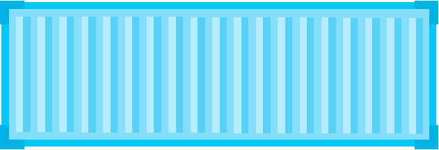

Powerby:
- [Apache Tomcat  Community](https://tomcat.apache.org)
- [tomcat-cluster-lab](https://github.com/bee-infraverse/tomcat-cluster-lab)

---

### Demos are Power by

 [Ivan Velichko iximiuz labs](https://iximiuz.com) 
[© 2025 bee42 solutions gmbh](https://bee42.com)
